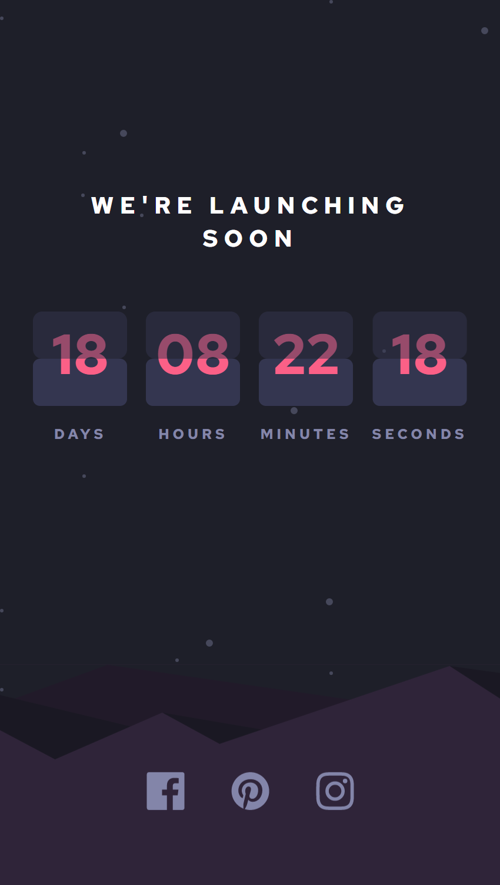
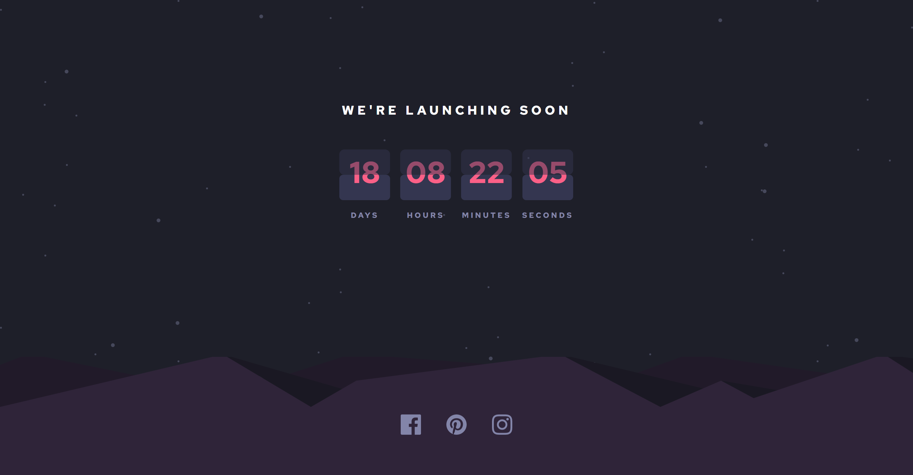

# Frontend Mentor - Launch countdown timer solution

This is a solution to the [Launch countdown timer challenge on Frontend Mentor](https://www.frontendmentor.io/challenges/launch-countdown-timer-N0XkGfyz-). Frontend Mentor challenges help you improve your coding skills by building realistic projects. 

## Table of contents

- [Overview](#overview)
  - [The challenge](#the-challenge)
  - [Screenshot](#screenshot)
  - [Links](#links)
- [My process](#my-process)
  - [Built with](#built-with)
  - [What I learned](#what-i-learned)
  - [Useful resources](#useful-resources)
- [Author](#author)

## Overview

### The challenge

Users should be able to:

- See hover states for all interactive elements on the page
- See a live countdown timer that ticks down every second (start the count at 14 days)
- **Bonus**: When a number changes, make the card flip from the middle

### Screenshot

### Links
- Solution URL: [Solution URL](https://www.frontendmentor.io/solutions/launch-countdown-timer-with-react-and-tailwind-15yDSgaz-1)
- Live Site URL: [Live Site URL](https://jfa-launch-countdown-timer.netlify.app/)

## My process

### Built with

- [React](https://reactjs.org/) - JS library
- [TypeScript](https://www.typescriptlang.org/) - JS Superset
- [Tailwind CSS](https://tailwindcss.com/) - Styles

### What I learned

I learned quite a bit about working with dates and time in JS and converting units of time. I also learned to extend Tailwind CSS with custom animations.

### Useful resources

- [Date and Time](https://javascript.info/date) - This documentation was very useful in working with date objects in JavaScript.

## Author

- Website - [Justin Fowler Art](https://www.justinfowlerart.com)